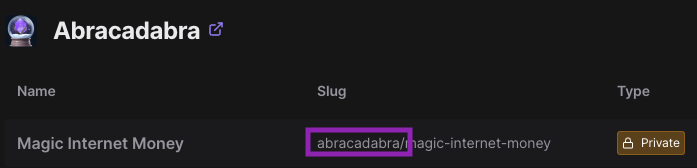

# Tenderly Tap

Tenderly Tap was created to help users quickly set up and fund test wallets on Tenderly RPC forks. With just a few clicks, you can:

- Add unlimited gas token to a wallet
- Transfer tokens from any wallet to another
- Refill Abracadabra cauldrons with $MIM

## Stack

Tenderly Tap uses the following technologies in its stack:

- Next.js
- Create React App
- Tailwind CSS
- ethers.js

## Getting Started

First create a copy of `.env.sample`, renaming it `.env`. The two environment variables are `NEXT_PUBLIC_TENDERLY_SLUG` and `NEXT_PUBLIC_TENDERLY_ACCESS_KEY`, both of which can be accessed via the Tenderly UI.

To find your slug, first visit the [projects page](https://dashboard.tenderly.co/projects). In the example below, the slug is `abracadabra`.

To create an access key, visit the [authorization page](https://dashboard.tenderly.co/account/authorization).

After than, simply install dependencies via `npm install` and run the development server with `npm run dev`.

## Deploy on Vercel

The easiest way to deploy your Next.js app is to use the [Vercel Platform](https://vercel.com/new?utm_medium=default-template&filter=next.js&utm_source=create-next-app&utm_campaign=create-next-app-readme) from the creators of Next.js.

Check out our [Next.js deployment documentation](https://nextjs.org/docs/deployment) for more details.
